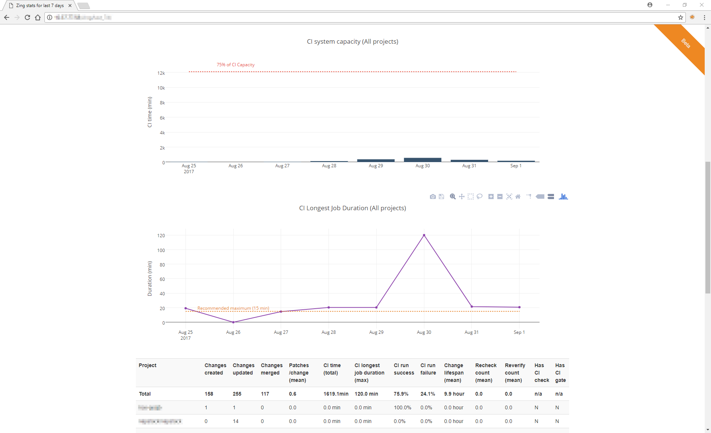

[](https://travis-ci.org/HewlettPackard/zing-stats)
[](https://hub.docker.com/r/zingstats/zing-stats/)
[](https://codecov.io/gh/HewlettPackard/zing-stats)
[](https://codeclimate.com/github/HewlettPackard/zing-stats/maintainability)

&copy; Copyright 2017,2018 Hewlett Packard Enterprise Development LP

# zing-stats

## Introduction

Tool for generating summary stat reports and graphs from Gerrit (https://www.gerritcodereview.com/) and GitHub Enterprise review and pull requests data.

Terminology:
- A change consists of 1 or more revisions (aka patches)
- Each time CI is triggered on a change, a CI run occurs
- A CI run consists of one or more CI jobs e.g. foo-copyright, foo-check and so on

For now, zing-stats expects job comments in the format printed by OpenStack Zuul. This needs to be more customisable in future. For now, if your
CI system uses a different format, you'll need to modify the hardcoded regexs.

## Screenshots

Example output with projects tab (--project-map specified)
")

Example output where CI jobs include duration info


Example output without projects (no projects tabs)
")

Example output of detailed stats section


## Installation

### Using virtualenv

```
git clone <url to zing-stats repo>
sudo apt install virtualenv
virtualenv ~/venv/zing-stats
. ~/venv/zing-stats/bin/activate
python setup.py install
```

## Running

### Running as a script

```
./zing_stats.py --gerrit-url <gerrit url> --github-url <github enterprise url> --github-token <github token> -o <output directory>
```

The team names used in zing-stats reports are read from projects.json

### Running as a docker container

#### Build container

This will build zingstats/zing-stats:latest and zingstats/zing-stats:<version> where version is derived from the git tag e.g. 0.5.2-1-ga49b866

```
export VERSION=$(git describe --tags); docker build --build-arg VERSION=$VERSION --build-arg http_proxy=$http_proxy --build-arg https_proxy=$https_proxy -t zingstats/zing-stats:$VERSION -t zingstats/zing-stats:latest .
```

#### Run container

(assumes projects.json is in your pwd, adjust the -v as neccesary if not)

```
docker run -v $(pwd)/projects.json:/projects.json -e GERRIT_URL=<gerrit url> -e GITHUB_URL=<github enterprise url> -e GITHUB_TOKEN=<github token> zingstats/zing-stats:<version>
```

e.g.

```
docker run -v $(pwd)/projects.json:/projects.json -e gerrit_host=https://review.openstack.org/ -e github_host=https://github.com/ zingstats/zing-stats:latest
```

### Running in docker compose

Uses docker compose to stand up dedicated containers for generation and
reporting.

1. Build the environment,
    ```
    docker-compose build --force-rm --no-cache
    ```
2. Create a docker-compose environment file (zing_stats.env) with your zing-stats arguments e.g.
    ```
    GERRIT_URL=https://gerrit.example.net
    GITHUB_URL=https://github.example.net
    GITHUB_TOKEN=345sdfe
    ZING_PROJECTS=/var/tmp/projects.json
    ```
3. Run the environment (detached)
    ```
    docker-compose up -d
    ```
4. Attach to running container
    ```
    docker-compose exec zing-stats /bin/bash
    docker-compose exec zing-stats-web /bin/ash
    ```
5. zing-stats output at http://localhost:8172/last_7d/ (may take some time depending on number of configured projects)


## Testing

```
python setup.py test
```

## Design
General strategy

1. Pull changes data from Gerrit (or a file)
2. Load data into Pandas DataFrames
3. Restrict to range of interest
4. Resample to days or hours
5. Extract stats (count, min, max, avg and so on)
6. Tabulate and plot

## Roadmap / Potential TODO

1. Verify against public Gerrit instances
2. Improve testing
3. Improve setup config
4. Investigate use of Pandas Panels (deprecated) or MultiIndex instead of lots of DataFrames.
5. Add statistics for jobs run (we collect this data, just a case of assembling it)
6. Add in highlighting of out of bounds values in the html report e.g. excessive failure rates in red
7. Other reports/stats requested:
    * how long changes are queued before getting a ci run (may need to query Zuul for this)
    * ci system utilisation/capacity (used total ci hours in the past here, alternative is to aggregate cpu/memory usage stats from the systems)
    * number of Zuul gate queue resets for a change (may need to query Zuul for this)
8. Job duration handling may only work for some Gerrit instances for now, need to determine if better way of gathering that.
9. CI capacity stat relies on job duration data, so this is also unavailable on some Gerrit instances.

## License
This project is licensed under the Apache 2.0 license. Please see [LICENSE](LICENSE) for more info.

## Contributing and feature requests
**Contributing:** You know the drill. Fork it, branch it, change it, commit it, and pull-request it.
We are passionate about improving this project, and glad to accept help to make it better. However, keep the following in mind:

 - You must sign a Contributor License Agreement first. Contact one of the authors (from Hewlett Packard Enterprise) for details and the CLA.
 - We reserve the right to reject changes that we feel do not fit the scope of this project, so for feature additions, please open an issue to discuss your ideas before doing the work.

**Feature Requests:** If you have a need that is not met by the current implementation, please let us know (via a new issue).
This feedback is crucial for us to deliver a useful product. Do not assume we have already thought of everything, because we assure you that is not the case.
